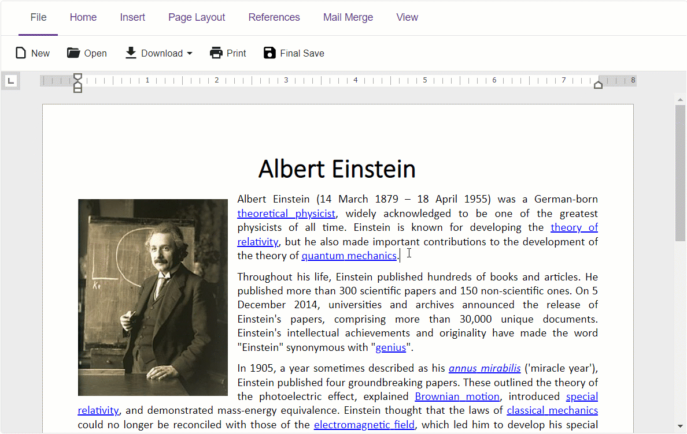

<!-- default badges list -->

<!-- default badges end -->
# Rich Edit for Blazor - How to implement custom saving

This example adds a custom **Final Save** button to the [Rich Text Editor](https://docs.devexpress.com/Blazor/DevExpress.Blazor.RichEdit.DxRichEdit)'s **File** tab. When a user clicks this button, the control performs the following actions:

1. Updates [fields](https://docs.devexpress.com/Blazor/DevExpress.Blazor.RichEdit.Field#remarks) in an open document.
2. Clears the content of the first section's [header](https://docs.devexpress.com/Blazor/DevExpress.Blazor.RichEdit.Section#section-headers-and-footers).
3. Inserts an [image](https://docs.devexpress.com/Blazor/DevExpress.Blazor.RichEdit.Image#remarks) to the header.
4. [Saves](https://docs.devexpress.com/Blazor/DevExpress.Blazor.RichEdit.DxRichEdit.SaveDocumentAsync(System.Threading.CancellationToken)) the open document.

## Overview

The [CustomizeRibbon](https://docs.devexpress.com/Blazor/DevExpress.Blazor.RichEdit.DxRichEdit.CustomizeRibbon) event allows you to access and customize the built-in ribbon UI. Call the [AddCustomButton](https://docs.devexpress.com/Blazor/DevExpress.Blazor.Office.BarItemCollection.AddCustomButton(System.Int32-System.String-System.Func-System.Threading.Tasks.Task-)) in the event handler to add a custom button to the ribbon. The method's `click` parameter sets this button's [Click](https://docs.devexpress.com/Blazor/DevExpress.Blazor.Office.IBarButton.Click) event handler.

Do one of the following to enable save operations in the Rich Text Editor:

* Handle the [DocumentContentChanged](https://docs.devexpress.com/Blazor/DevExpress.Blazor.RichEdit.DxRichEdit.DocumentContentChanged) event.
* Implement [two-way data binding](https://docs.devexpress.com/Blazor/402330/common-concepts/two-way-data-binding) between the [DocumentContent](https://docs.devexpress.com/Blazor/DevExpress.Blazor.RichEdit.DxRichEdit.DocumentContent) property and a data field. 

Call the [SaveDocumentAsync](https://docs.devexpress.com/Blazor/DevExpress.Blazor.RichEdit.DxRichEdit.SaveDocumentAsync(System.Threading.CancellationToken)) method in the custom button's click event handler to save changes. Use the [Modified](https://docs.devexpress.com/Blazor/DevExpress.Blazor.RichEdit.DxRichEdit.Modified) property to check whether an open document has unsaved changes. Depending on this, [enable or disable](https://docs.devexpress.com/Blazor/DevExpress.Blazor.Office.IBarItem.GetEnabled) the custom button.

## Files to Look At

- [Index.razor](./CS/SaveDocuments/Pages/Index.razor)

## Documentation

- [UI Customizatiom](https://docs.devexpress.com/Blazor/DevExpress.Blazor.RichEdit.DxRichEdit#ui-customization)
- [Document Management](https://docs.devexpress.com/Blazor/403344/rich-edit/document-management)
- [Rich Text Editor Examples](https://docs.devexpress.com/Blazor/403343/rich-edit/examples)

## More Examples

- [Rich Edit for Blazor - How to check whether the document is empty](https://github.com/DevExpress-Examples/blazor-dxrichedit-check-if-document-is-empty)
- [Rich Edit for Blazor - How to export a document to a file in HTML format](https://github.com/DevExpress-Examples/blazor-dxrichedit-export-to-html)
