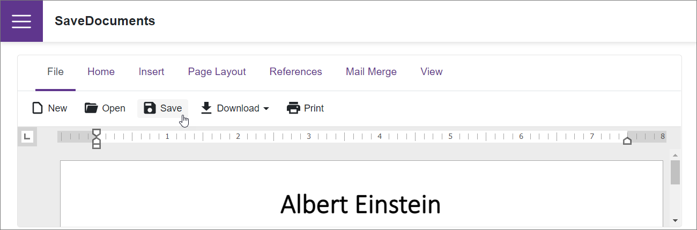

<!-- default badges list -->

<!-- default badges end -->
# Rich Edit for Blazor - How to implement custom saving

The [Rich Text Editor](https://docs.devexpress.com/Blazor/DevExpress.Blazor.RichEdit.DxRichEdit) component allows you to implement custom saving. In this example, the component performs the following actions when a user saves an open document:

1. Updates [fields](https://docs.devexpress.com/Blazor/DevExpress.Blazor.RichEdit.Field#remarks) in the document.
2. Clears the content of the first section's [header](https://docs.devexpress.com/Blazor/DevExpress.Blazor.RichEdit.Section#section-headers-and-footers).
3. Inserts an [image](https://docs.devexpress.com/Blazor/DevExpress.Blazor.RichEdit.Image#remarks) to the header.

The [DocumentContent](https://docs.devexpress.com/Blazor/DevExpress.Blazor.RichEdit.DxRichEdit.DocumentContent) property specifies an open document's content. The Rich Text Editor updates this property value and raises the [DocumentContentChanging](https://docs.devexpress.com/Blazor/DevExpress.Blazor.RichEdit.DxRichEdit.DocumentContentChanging) and then the [DocumentContentChanged](https://docs.devexpress.com/Blazor/DevExpress.Blazor.RichEdit.DxRichEdit.DocumentContentChanged) events in the following cases:

* A user selects the **File** → **Save** ribbon command.

* A user presses **CTRL+S**.

* You call the [SaveDocumentAsync](https://docs.devexpress.com/Blazor/DevExpress.Blazor.RichEdit.DxRichEdit.SaveDocumentAsync(System.Threading.CancellationToken)) method.

* An [auto-save timeout](https://docs.devexpress.com/Blazor/DevExpress.Blazor.RichEdit.DxRichEdit.AutoSaveTimeout) expires.

The [DocumentContentChanging](https://docs.devexpress.com/Blazor/DevExpress.Blazor.RichEdit.DxRichEdit.DocumentContentChanging) event allows you to edit an open document before saving. Handle the [DocumentContentChanged](https://docs.devexpress.com/Blazor/DevExpress.Blazor.RichEdit.DxRichEdit.DocumentContentChanged) event to save the document, overwise the component disables save operations and hides the **File** → **Save** ribbon command.

## Files to Look At

- [Index.razor](./CS/SaveDocuments/Pages/Index.razor)

## Documentation

- [Document Management in the Rich Text Editor](https://docs.devexpress.com/Blazor/403344/rich-edit/document-management)
- [Rich Text Editor Examples](https://docs.devexpress.com/Blazor/403343/rich-edit/examples)

## More Examples

- [Rich Edit for Blazor - How to check whether the document is empty](https://github.com/DevExpress-Examples/blazor-dxrichedit-check-if-document-is-empty)
- [Rich Edit for Blazor - How to export a document to a file in HTML format](https://github.com/DevExpress-Examples/blazor-dxrichedit-export-to-html)
